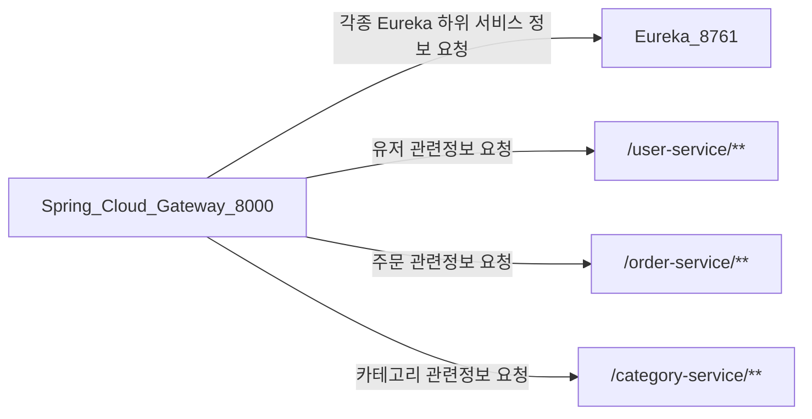

# MSA_STUDY_PROJECT
this project for studying MSA and Spring cloud gateway

## 기본정보
기본적인 프로젝트의 플로우는 다음과 같음.
1. Eureka에 클라이언트 서비스들의 정보가 올라온다.
2. Gateway서비스가 하위 서비스의 정보를 Eureka에서 가져간다.(기본 라우팅 정보는 가지고있음)
3. path별로 요청시 각각의 서비스들이 응답한다.

Eureka 기본 port 8761

